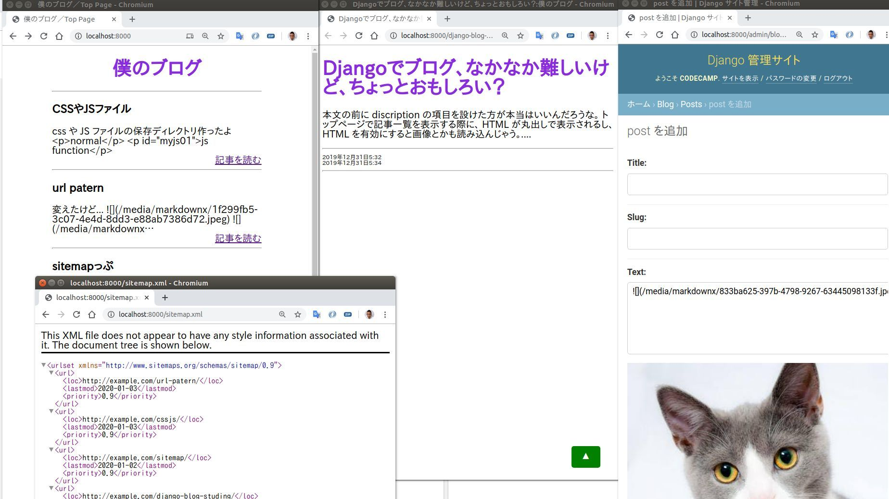

+ 文字型のURL（slug）
+ マークダウン・エディタ機能（Markdownx）
+ File Upload
+ sitemap.xml
+ base.html
+ static folder for CSS/JS 

+ Django3
+ SQLite

+ admin// username: codecamp,  password: pythonlove

Django でブログをはじめる時のテンプレに

### 足りない点

+ サムネイル画像
+ タグもしくはカテゴリ
+ 検索機能
